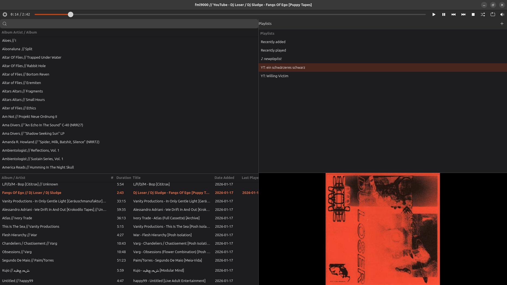
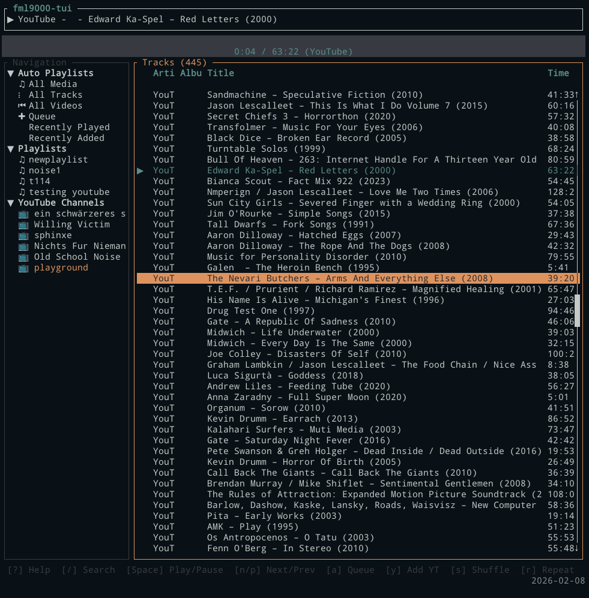
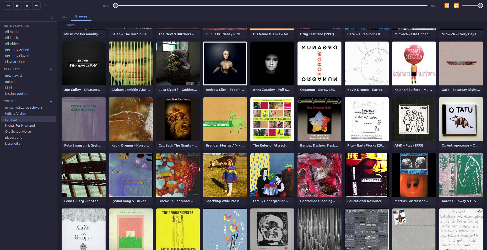

## fml9000

A music player written in Rust with multiple frontends: GTK4, TUI, Web, and CLI

## Features/concepts

- Inspired by foobar2000
- Multiple frontends sharing the same library and database:
  - **GTK4 GUI** (`fml9000-gtk`) - desktop app using `gtk4-rs` + libadwaita
  - **Web UI** (`fml9000-web`) - axum server + SolidJS frontend
  - **TUI** (`fml9000-tui`) - terminal UI using `ratatui`
  - **CLI scanner** (`fml9000-scan`) - command-line library management
  - **fzf browser** - shell script using fzf + mpv
- Plays youtube videos embedded in app
- Show embedded art, folder art, or youtube thumbnail
- Play audio with rust `rodio` library or `mpv` for youtube
- Add all videos from a youtube channel to your library
- Recently added, recently played, and playback queue auto playlists
- Optionally auto-scan one or more folders
- Keeps track metadata in `sqlite` database with `diesel`
- Not MPD based (could be good or bad depending on your point of view)


## Screenshot


GUI with GTK


TUI for the terminal, uses same database


Web UI served by axum, uses same database


## Usage

```bash
git clone https://github.com/cmdcolin/fml9000
cd fml9000
cargo run -p fml9000-scan  # command-line library scanner
cargo run -p fml9000-tui   # terminal mode
cargo run -p fml9000-gtk   # gui mode
cargo run -p fml9000-web   # web server (http://localhost:8080)
```

### Web UI

The web frontend is built with SolidJS + TypeScript and served by an axum
(Rust) server. Audio plays server-side via rodio.

**Production mode** (serve pre-built frontend):
```bash
cd crates/fml9000-web/frontend
pnpm install
pnpm build
cd ../../..
cargo run -p fml9000-web  # http://localhost:8080
```

**Development mode** (Vite HMR + axum API):
```bash
./crates/fml9000-web/dev.sh  # starts both, open http://localhost:5173
```

Or run them separately:
```bash
cargo run -p fml9000-web                      # terminal 1 - axum on :8080
cd crates/fml9000-web/frontend && pnpm dev    # terminal 2 - vite on :5173
```

Features: track table with sorting/search, album browse grid with cover art,
sidebar navigation (auto playlists, user playlists, YouTube channels), playback
controls, seek/volume, shuffle/repeat, right-click context menus, keyboard
shortcuts, WebSocket real-time state updates, auto-advance, play count
tracking, settings persistence, URL hash routing.


## TUI Keyboard Shortcuts

### Navigation

| Key           | Action                    |
| ------------- | ------------------------- |
| `j` / `Down`  | Move selection down       |
| `k` / `Up`    | Move selection up         |
| `h` / `Left`  | Collapse nav section      |
| `l` / `Right` | Expand nav section        |
| `Tab`         | Switch panel              |
| `Enter`       | Play / Select             |
| `/`           | Search                    |
| `Esc`         | Cancel / Close            |
| `1`-`6`       | Quick nav to auto playlists |

### Playback

| Key     | Action              |
| ------- | ------------------- |
| `Space` | Play / Pause        |
| `n`     | Next track          |
| `p`     | Previous track      |
| `s`     | Stop (or shuffle)   |
| `S`     | Toggle shuffle      |
| `r`     | Cycle repeat mode   |

### Actions

| Key           | Action                |
| ------------- | --------------------- |
| `a`           | Add to queue          |
| `y`           | Add YouTube channel   |
| `?`           | Show help             |
| `q`           | Quit                  |
| Right-click   | Context menu          |
| Double-click  | Play track            |

## Web UI Keyboard Shortcuts

| Key     | Action         |
| ------- | -------------- |
| `Space` | Play / Pause   |
| `n`     | Next track     |
| `p`     | Previous track |
| `s`     | Stop           |

## CLI / Shell Usage

The library database is stored as SQLite at `~/.config/fml9000/library.db`, so
you can query it directly with `sqlite3`.

### Library Scanner

`fml9000-scan` is a standalone command-line tool for scanning your music library.

**First-time setup** (no config yet):
```bash
cargo run -p fml9000-scan
# Prompts you to enter music folder paths interactively
#   Add folder: ~/Music
#     Added: /home/user/Music
#   Add folder: ~/Downloads/Albums
#     Added: /home/user/Downloads/Albums
#   Add folder:
# Settings saved.
```

**Quick setup** (pass directories as arguments):
```bash
cargo run -p fml9000-scan ~/Music ~/Downloads/Albums
# Added 2 folder(s) to config.
# Scanning 2 folder(s)...
```

**Rescan** (if already configured):
```bash
cargo run -p fml9000-scan
# Scanning 1 folder(s)...
#   /home/user/Music
# 1234 tracks already in library
#
# Scanning: /home/user/Music
#   5678 files, 1234 existing, 42 new
#
# Scan complete:
#   5678 files found
#   1234 already up to date
#   42 added
#
# 3 tracks no longer found on disk. Remove from library? [y/N]
```

Features:
- Scans configured folders for audio files (mp3, flac, ogg, opus, wav, aac, m4a, etc.)
- Detects and prompts before removing stale tracks (files deleted from disk)
- Handles files without tags (adds with filename and duration only)
- Shows live progress with file counts
- Shares the same config and database as the GUI and TUI apps

### fzf + mpv browser

A script at `scripts/fml9000-fzf.sh` lets you browse and play your library from
the terminal using fzf and mpv.

```bash
./scripts/fml9000-fzf.sh            # Interactive menu (pick a category, then browse)
./scripts/fml9000-fzf.sh tracks     # Browse local tracks only
./scripts/fml9000-fzf.sh videos     # Browse youtube videos only
./scripts/fml9000-fzf.sh playlists  # Browse playlists
./scripts/fml9000-fzf.sh channels   # Browse youtube channels, then their videos
./scripts/fml9000-fzf.sh recent     # Recently played
```

### Export to text

```bash
./scripts/fml9000-fzf.sh export         # Full library dump (TSV)
./scripts/fml9000-fzf.sh export-tracks  # Tracks as TSV
./scripts/fml9000-fzf.sh export-videos  # Videos as TSV
```

### Ad-hoc queries

```bash
# List all tracks
sqlite3 -header -column ~/.config/fml9000/library.db \
  "SELECT artist, title, album FROM tracks ORDER BY artist;"

# Play a random track
mpv --no-video "$(sqlite3 ~/.config/fml9000/library.db \
  'SELECT filename FROM tracks ORDER BY RANDOM() LIMIT 1')"

# Play a random YouTube video
mpv "https://youtube.com/watch?v=$(sqlite3 ~/.config/fml9000/library.db \
  'SELECT video_id FROM youtube_videos ORDER BY RANDOM() LIMIT 1')"
```

## Notes

Still a very alpha quality software work in progress

This project started in 2022 pre-AI usage, but was revisited in 2026 using Claude Code

See also web version of youtube player https://cmdcolin.github.io/ytshuffle/
