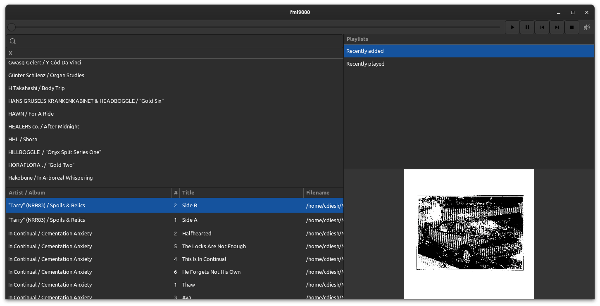

## fml9000

A music player written in Rust with GTK4-rs

## Screenshot



Note: not all features pictured work yet, but it does look like this :)

## Usage

```
git clone https://github.com/cmdcolin/fml9000
cd fml9000
cargo run
```

## Troubleshooting

Usage with Linuxbrew may not work, I had to completely uninstall linuxbrew to
make the development work on my computer. A minimal homebrew/linuxbrew install
may work but certain pacakages may confuse pkg-config too much. See
https://github.com/tauri-apps/tauri/issues/3856

